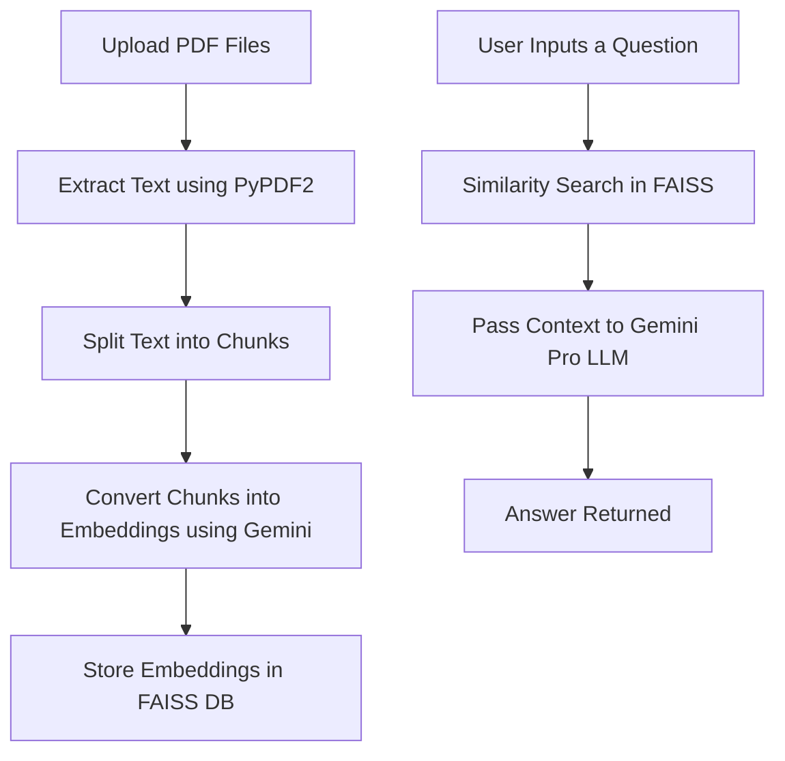

# 📄 DocBuddy: Your AI-Powered PDF Companion

This is a Streamlit-based application that lets you upload PDF documents, processes them using Google Gemini embeddings, stores them in FAISS vector DB, and then allows you to ask questions from the documents interactively.

> 💡 Powered by Google Gemini's `embedding-001` & `gemini-pro` and LangChain.

---

## 🚀 Features

* Upload multiple PDF files
* Extract and chunk the text
* Generate vector embeddings with Gemini
* Store and load FAISS vector database locally
* Ask natural language questions
* Returns accurate answers grounded in the document content
* Runs in browser using Streamlit

---

## ⚙️ Tech Stack

| Layer               | Technology                            |
| :----------------   | :------------------------------------ |
| **Language Model**  | Google Gemini Pro (`gemini-2.5-pro`)  |
| **Embedding Model** | `models/embedding-001` from Google    |
| **Framework**       | LangChain                             |
| **Frontend**        | Streamlit                             |
| **Vector Database** | FAISS                                 |
| **PDF Parsing**     | PyPDF2                                |
| **Environment Vars**| python-dotenv                         |

---

## 🔁 Workflow / How It Works



---

## 📌 Steps

1.  Upload PDFs via **Streamlit**.
2.  Text is extracted using `PyPDF2`.
3.  Chunking is done with `RecursiveCharacterTextSplitter`.
4.  Embeddings for each chunk are created using `GoogleGenerativeAIEmbeddings`.
5.  Chunks are stored in a local **FAISS** vector store (`faiss_index`).
6.  When a user asks a question, the system:
    * Searches similar chunks using **FAISS**.
    * Passes relevant chunks + question to the **Gemini LLM**.
    * Returns the answer.

---

## 💪 Setup Instructions

1.  **Clone the repo**
    ```bash
    git clone [https://github.com/tyagi0320/DocBudyy.git](https://github.com/tyagi0320/Docbuddy.git)
    cd DocBuddy
    ```
2.  **Install dependencies**

    Create and activate a virtual environment (optional but recommended):
    ```bash
    python -m venv venv
    source venv/bin/activate   # On Windows: venv\Scripts\activate
    ```
    Install required packages:
    ```bash
    pip install -r requirements.txt
    ```
    Create a file named `.env` in the root directory and add your API key:
    ```env
    GOOGLE_API_KEY="your_google_generative_ai_api_key_here"
    ```
3.  **Run the app**
    ```bash
    streamlit run app.py
    ```

---

## 📷 Screenshots

*(Add screenshots after running the app locally)*

---

## 💡 Example Prompts

* "What is the objective of this paper?"
* "Summarize the methodology used in this document."
* "List the key findings from section 3."

---

## 🧹 File Structure

```
chat-with-pdf-gemini/
│
├── app.py                # Main Streamlit app
├── requirements.txt      # Python dependencies
├── .env                  # API key (not committed)
├── faiss_index/          # Folder where vector DB is saved
└── README.md             # Project documentation
```

---

## 📄 License

This project is open-source under the **MIT License**.

---

## 🤛🏼‍♂️ Author

Built with ❤️ by **Harshit Tyagi**

[LinkedIn](https://www.linkedin.com/in/tyagi-harshit) | [GitHub](https://github.com/harshittyagii)
